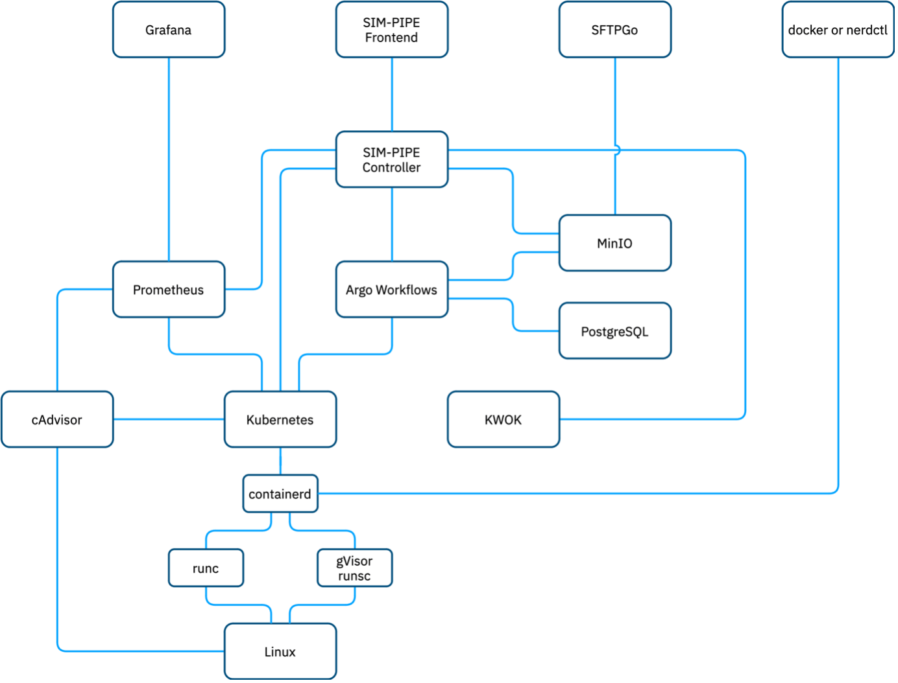

#	Architecture
SIM-PIPE consists of a stateless NodeJS controller, a SvelteKit graphical user interface, and several open-source components. The controller provides a GraphQL API for the graphical user interface and other tools of the DataCloud toolbox.

The following sections will elaborate on each component. We encourage you to review the accompanying architecture diagram to visualise how these elements interrelate and function together.

We designed the architecture of SIM-PIPE to mirror real-world systems to provide an accurate and valuable simulation environment. We also designed the system to operate seamlessly on a developer’s laptop. Additionally, we commit ourselves to utilise only open-source software components.

## Kubernetes, the container orchestration platform
Kubernetes, often referred to as K8s, is an open-source platform designed to automate deploying, scaling, and managing containerised applications. It groups containers that make up an application into logical units for easy management and discovery. Kubernetes provides a framework to run distributed systems resiliently, handling tasks such as failover, scaling, and rolling updates.

Kubernetes services, support, and tools are widely available, making it a popular choice for managing complex infrastructures in a systematic and automated way. Its features, like self-healing, automatic rollouts and rollbacks, secret and configuration management, storage orchestration, and more, help facilitate both declarative configuration and automation, simplifying many of the complexities and challenges associated with managing large-scale, distributed applications.

Initially, we developed our solution around Docker Engine, but we decided to transition to Kubernetes due to its widespread adoption as the industry standard for container orchestration. The emergence of lightweight Kubernetes distributions, such as K3S and K0S, has made it possible to use Kubernetes as a viable alternative to Docker Engine and Compose, even in environments with limited resources or on single-node configurations, without significant overhead.

Incorporating Kubernetes into our SIM-PIPE tool brings our development environment closer to the production environment, where we will ultimately execute the data pipelines. This shift enhances the efficiency and scalability of our operations and improves the portability and reliability of the data pipelines we deploy.

## Argo Workflows, to run software container-based data pipelines.
Argo Workflows is an open-source, container-native workflow engine for orchestrating data pipelines and jobs on Kubernetes. It aims to solve complex data processing tasks, and many people use it for machine learning pipelines, data transformations, and scientific workflows.

Argo Workflows allows to define tasks and their dependencies using a simple, declarative language and handles scheduling and inter-task communication. It supports complex job orchestration using Directed Acyclic Graphs (DAG), and it can run tasks in parallel, in sequence, or based on conditions. It also provides powerful features like parameterisation, artefact handling, and retries on failures.

## CAdvisor, to gather detailed metrics.
cAdvisor (Container Advisor) is an open-source tool for monitoring running container resource usage and performance characteristics. It provides users with metrics such as CPU usage, memory usage, network activity, and filesystem usage for each container running on a system. cAdvisor is specifically designed to support Docker containers but can also work with any other container type that supports the cgroup filesystem.
It provides a simple web UI that presents real-time and historical data, and it can also expose data to various storage backends such as Prometheus. cAdvisor’s lightweight nature and ability to run as a daemon make it an ideal tool for collecting and understanding container performance data in production environments.
While Kubernetes natively includes cAdvisor for essential resource usage monitoring, the metric sampling frequency is hardcoded to 15 seconds and may not be sufficient for our use cases. A separate instance of cAdvisor is often run alongside Kubernetes to support more granular and frequent data collection.

## Prometheus, to collect and store metrics.
Prometheus is an open-source systems monitoring and alerting toolkit. Prometheus fundamentally operates on a pull model, scraping metrics from instrumented jobs, either directly or via an intermediary push gateway for short-lived jobs. It stores all scraped samples locally and runs rules over this data to generate alerts or compute more advanced metrics.
Prometheus features a multi-dimensional data model with time series data identified by metric name and key/value pairs, a flexible query language to leverage this dimensionality called PromQL (Prometheus Query Language), and no reliance on distributed storage.

Its strong integration capabilities make it a popular choice for a monitoring system in a cloud-native environment. Prometheus supports remote storage integrations that allow for long-term scalability of data storage by offloading the storage of historical metrics data to these remote systems, enhancing its capacity without overwhelming the local storage resources. Thanos, Cortex, and VictoriaMetrics are some of the popular remote storage integrations for Prometheus.

Prometheus offers a robust set of tools for collecting, analysing, and alerting on system and application metrics, making it a critical component in many infrastructure monitoring stacks.

## MinIO, the object store.
MinIO is an open-source object storage server, compatible with Amazon S3, that supports large-scale data infrastructure and smaller use cases. We employ MinIO to securely store files, including the inputs, outputs, and intermediate data files associated with our data pipelines. Its high performance, ease of deployment, and scalability make it an ideal solution for managing various types of unstructured data, thereby ensuring the smooth operation of our data pipeline processes from start to finish.

Although MinIO is an effective solution for our object storage needs, we can replace it seamlessly with any other S3-compatible object storage system that suits our specific requirements or preferences. For instance, Garage or Ceph can serve as viable alternatives.

## SFTPGo, every file transfer protocol for everyone.
SFTPGo is an open-source, fully featured server that supports multiple file transfer protocols, including SFTP, HTTP, FTP(S), and WebDAV. In our context, we leverage SFTPGo to extend the functionality of our S3-based storage infrastructure, offering users the flexibility to manipulate their files using their preferred protocols.

## Grafana, to make beautiful dashboards.
Grafana is an open-source, multi-platform analytics and interactive visualisation web application that provides charts, graphs, and alerts for the web when connected to supported data sources. People widely use it for its ability to display metric data in a variety of intuitive and visually appealing ways, including time-series plots and heatmaps, among others.
In our environment, we offer Grafana as an option for users who are familiar with it, acknowledging its prevalence and respect in the metrics monitoring landscape. Its wide adoption in the industry makes it a comfortable and powerful tool for many users to analyse and understand their data, thereby enhancing the efficiency and effectiveness of our monitoring capabilities.

## PostgreSQL, to persist long-term data.
PostgreSQL is a very popular powerful, open-source object-relational SQL database.
In the context of Argo Workflows and Kubernetes, data is stored as Kubernetes resources, usually via an etcd cluster or an SQLite database. However, to prevent overloading the internal Kubernetes database, Argo Workflows archives completed runs into a PostgreSQL database. This approach efficiently segregates active and archived data, ensuring the smooth operation of the Kubernetes cluster.

## K3S, a good Kubernetes Distribution
SIM-PIPE can operate on every Kubernetes distribution, as it only uses the standard Kubernetes features and no distribution-specific features. If the user does not already use a specific Kubernetes distribution, we recommend using K3S.

K3S is a lightweight, easy-to-install Kubernetes distribution developed by Rancher Labs, designed for developers and edge computing. It packages Kubernetes and the necessary dependencies into a single binary, reducing the footprint and simplifying the installation and operation.
Despite its compact nature, K3S retains the robustness and extensibility of Kubernetes, making it suitable for a wide range of applications. It is handy in resource-constrained environments, such as IoT devices or edge locations. It also serves as an efficient solution for developers looking for a straightforward way to run Kubernetes locally for development and testing purposes.

## Docker, the classic software container command line interface
The Docker Command Line Interface (CLI) is a widely used tool that allows developers to interact with Docker. Due to its comprehensive functionality and user-friendly design, Docker CLI has become the de facto standard in container management, offering a consistent interface that developers have come to rely on. Therefore, we designed SIM-PIPE to integrate nicely with Docker CLI. The default configuration shares the docker images cache between Docker and Kubernetes, allowing one to build containers with Docker CLI and then run them with SIM-PIPE inside Kubernetes.
Please note that we’re referring to the open-source Docker CLI, not the proprietary Docker Desktop. While Docker Desktop includes the Docker CLI, it also provides additional features and tools which are not open source.

While Docker CLI is the most prevalent, there are alternatives available. Nerdctl, for instance, is a command-line interface compatible with Docker CLI commands and can serve as a drop-in replacement. Another alternative is Podman, which offers a similar command set and functionality, but with a focus on security. Users can also use these alternatives if they build software containers compliant with the Open Container Initiative (OCI) standards.

## SIM-PIPE runs on any operating system, as long as it runs Linux.
SIM-PIPE requires a Linux-based operating system. Kubernetes requires a Linux-based operating system because it relies on Linux kernel features, such as cgroups and namespaces. These kernel features enable containers to isolate resources, manage resource allocation, and achieve process isolation. They are essential for efficient and secure containerisation of applications.

Furthermore, the open-source community of Linux consistently develops and enhances container-related technologies in an extensive, dynamic, and supportive manner. As a result, container tools, libraries, and resources are optimally designed and optimised to work seamlessly with Linux-based systems. The open-source nature of Linux promotes innovation, collaboration, and rapid adoption of new technologies, especially containerisation. Therefore, developers design Kubernetes and software containers to operate on Linux-based operating systems.

We leverage Windows Subsystem for Linux 2 (WSL2) and Colima for Windows and Mac users to allow seamless interaction with Linux virtual machines.

## KWOK, Kubernetes Pretend Play
KWOK is a toolkit that lets you create a virtual simulation Kubernetes cluster of thousands of nodes and pods in seconds. KWOK fakes the nodes and pods by updating their status and events. It does not run any software container for real. It’s only pretending to do so. This way, KWOK can quickly create and manage virtual clusters with low resource usage.

KWOK is helpful because it helps learning, developing, testing, and experimenting with Kubernetes features and tools without needing a real cluster or other components. One can use any tools or clients that work with Kubernetes APIs, such as kubectl, helm, and k9s. To observe how Kubernetes reacts, one can modify node types, labels, taints, capacities or conditions. Simulating pod orchestration with different resource requests or limits is also possible.

SIM-PIPE uses KWOK to simulate data pipeline workloads on Kubernetes. KWOK enables the scaling of data pipelines and the observation of their behaviours by testing them under various conditions and environments.

## gVisor, a sandbox for software containers.
gVisor is an open-source sandboxing technology that provides an additional isolation layer for running containers. It integrates with Docker and Kubernetes, allowing one to sandbox applications without needing changes in the code.

Unlike traditional container systems that interact directly with the host kernel, gVisor intercepts application system calls and acts as the guest kernel, thereby reducing the surface for kernel vulnerabilities. This unique approach significantly enhances the security of containerised applications by mitigating the effects of container escape vulnerabilities and limiting potential attack vectors.

SIM-PIPE can use a gVisor Kubernetes runtime class to run data pipeline dry runs in a sandbox. However, it is not enabled by default on local installations because it makes the installation process much more challenging.

## Re-Architecture
Our original design for SIM-PIPE was built atop the Docker engine, utilising a custom-made software container pipeline orchestrator. This approach aimed at a minimalist implementation with minimal overhead. However, this proved to be more challenging than anticipated. We needed to develop many features already provided by tools such as Kubernetes, Argo Workflows, cAdvisor, and Prometheus.

While we successfully demonstrated a proof of concept, we recognised that incorporating the most important lacking features would require an enormous effort, and maintaining SIM-PIPE under these conditions would be challenging.

By opting to utilise industry-standard tools such as Kubernetes, Prometheus, and together with Argo Workflows, we can now present a simulation environment that more closely mirrors the final deployment environments. This shift also allows us to concentrate our development efforts on introducing more distinctive and innovative features, enhancing the overall value of SIM-PIPE.